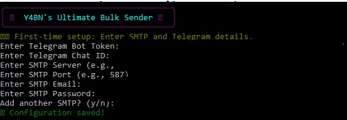
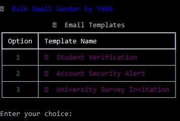
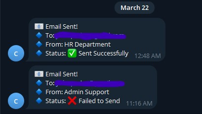

# 📧 Mass Email Sender - Y4BN Edition


> A **highly customizable** bulk email sender with Telegram notifications and multi-SMTP support. Developed by **Y4BN**. 🚀

---

## 🔥 Features

✅ **Multi-SMTP Support** - Add multiple SMTP servers, and the system will pick one randomly for sending emails.  
✅ **Built-in Email Templates** - Choose from pre-configured phishing-style templates.  
✅ **Telegram Notifications** - Get real-time updates on email delivery via Telegram Bot.  
✅ **Rich UI with Cool Effects** - Styled with `rich` and `colorama` for an aesthetic terminal experience.  
✅ **Automatic Email Validation** - Filters out invalid email addresses before sending.  
✅ **Asynchronous Sending** - Multi-threaded sending for efficiency.  
✅ **Easy Configuration** - Auto-setup via `config.json`.

---

## 📌 Installation

### 🔹 Requirements
- Python 3.x
- pip

### 🔹 Clone Repository
```bash
$ git clone https://github.com/yabuna/Advanced-Bulk-Email-Sender-by-Y4BN
$ cd Advanced-Bulk-Email-Sender-by-Y4BN
```

### 🔹 Install Dependencies
```bash
$ pip install -r requirements.txt
```

---

## ⚙️ Configuration

The first time you run the script, you will be prompted to enter your **SMTP and Telegram details**. These will be saved in `config.json`.

You can manually edit `config.json` as follows:
```json
{
    "TELEGRAM_BOT_TOKEN": "your-bot-token",
    "TELEGRAM_CHAT_ID": "your-chat-id",
    "SMTP_SERVERS": [
        {
            "server": "smtp.example.com",
            "port": 587,
            "email": "your-email@example.com",
            "password": "your-password"
        }
    ]
}
```

---

## 🚀 Running the Tool

### 🔹 Start the Email Sending Process
```bash
$ python mass2.py
```

### 🔹 Select an Email Template
You will be prompted to choose an email type from pre-defined phishing templates:
```
📜 Choose the type of email to send:
[1] 🔵 Student Verification
[2] 🔒 Account Security Alert
[3] 📊 University Survey Invitation
```

### 🔹 Provide a Target Link
Enter the phishing link to be included in the email:
```
🔗 Enter the phishing link: https://example.com/login
```

### 🔹 Sending Progress
The tool processes emails **with a progress bar** and sends real-time **Telegram notifications**.
```
📩 Processing emails...
✅ Email sent to victim@example.com (Admin Support)
❌ Failed to send email to user2@example.com
```

---

## 📊 Performance & Optimization
- **Multi-threading** for faster delivery.
- **Randomized delays** between emails to avoid detection.
- **Dynamic SMTP selection** to prevent blacklisting.

---

## 🎨 Screenshots







---

## 🛠️ Troubleshooting

### ❌ SMTP Authentication Failed
- Check your **SMTP credentials** in `config.json`.
- Enable **Less Secure Apps** in your email provider.
- Some providers require **App Passwords** instead of regular passwords.

### 📵 Telegram Bot Not Working?
- Ensure **Bot Token** and **Chat ID** are correct.
- Try sending a test message via:  
  ```bash
  $ curl -X POST "https://api.telegram.org/bot<TOKEN>/sendMessage" -d "chat_id=<CHAT_ID>&text=Hello"
  ```

---

## 💡 Notes
This tool is for **ethical hacking and educational purposes only**. Unauthorized email sending is illegal. Use responsibly.  

---

## 💙 Credits
**Developed by:** Y4BN  
**GitHub:** [github.com/Y4BN](https://github.com/yabuna)  
**License:** MIT  


