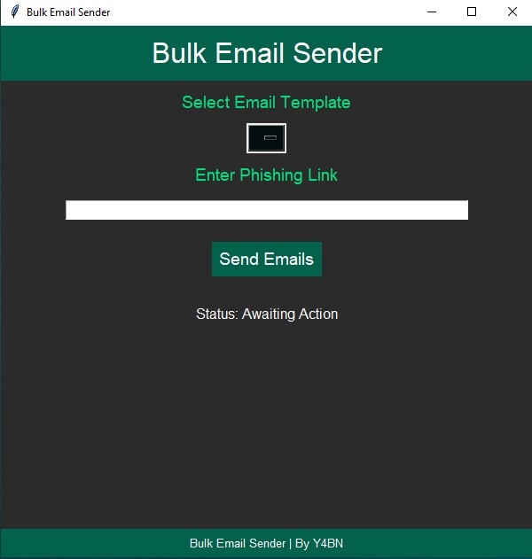

# 📧 Mass Email Sender - Y4BN Edition


> A **highly customizable** bulk email sender with Telegram notifications and multi-SMTP support. Developed by **Y4BN**. 🚀

---

## 🔥 Features

✅ **Multi-SMTP Support** - Add multiple SMTP servers, and the system will pick one randomly for sending emails.  
✅ **Built-in Email Templates** - Choose from pre-configured phishing-style templates.  
✅ **Telegram Notifications** - Get real-time updates on email delivery via Telegram Bot.  
✅ **Rich UI with Cool Effects** - Styled with `rich` and `colorama` for an aesthetic terminal experience.  
✅ **Automatic Email Validation** - Filters out invalid email addresses before sending.  
✅ **Asynchronous Sending** - Multi-threaded sending for efficiency.  
✅ **Easy Configuration** - Auto-setup via `config.json`.

---

## 📌 Installation

### 🔹 Requirements
- Python 3.x
- pip

### 🔹 Clone Repository
```bash
$ git clone https://github.com/yabuna/Advanced-Bulk-Email-Sender-by-Y4BN
$ cd Advanced-Bulk-Email-Sender-by-Y4BN
```

### 🔹 Install Dependencies
```bash
$ pip install -r requirements.txt
```

---

## ⚙️ Configuration

The first time you run the script, you will be prompted to enter your **SMTP and Telegram details**. These will be saved in `config.json`.

You can manually edit `config.json` as follows:
```json
{
    "TELEGRAM_BOT_TOKEN": "your-bot-token",
    "TELEGRAM_CHAT_ID": "your-chat-id",
    "SMTP_SERVERS": [
        {
            "server": "smtp.example.com",
            "port": 587,
            "email": "your-email@example.com",
            "password": "your-password"
        }
    ]
}
```

---

## 🚀 Running the `.exe` File

1. **Double-Click the `.exe` File**:  
   - Navigate to the `dist` folder, where you’ll find the `BulkEmailSender.exe` file.
   - Simply double-click on the `.exe` file to launch the tool.

2. **Initial Configuration (First Run)**:
   - The first time you run the tool, you will be prompted to enter your **SMTP and Telegram details**.
   - A window will open, requesting the following inputs:

### ⚙️ Configuration Prompts

- **Enter SMTP Server Details**:
   - SMTP Server: This is the email server you’ll use for sending emails (e.g., `smtp.gmail.com`).
   - SMTP Port: This is the port number used by your SMTP provider (usually `587` for TLS).
   - Email Address: The email address you’ll send the emails from.
   - SMTP Password: The password for the email address you're using.

   Example:
   ```
   SMTP Server: smtp.example.com
   SMTP Port: 587
   Email Address: your-email@example.com
   SMTP Password: your-password
   ```

- **Enter Telegram Bot Details**:
   - **Bot Token**: The token you got when creating your Telegram bot.
   - **Chat ID**: Your chat ID where notifications will be sent (can be obtained via Telegram Bot API or using a simple bot command).

---

## 🚀 Running the Tool

1. **Choose an Email Template**:  
   Once your configuration is set, you'll be prompted to choose an email template to send. Here’s what it looks like:
   ```
   📜 Choose the type of email to send:
   [1] 🔵 Student Verification
   [2] 🔒 Account Security Alert
   [3] 📊 University Survey Invitation
   ```

   - Type the number corresponding to the template you want to use and press **Enter**.

2. **Enter the Phishing Link**:  
   After selecting the email template, you will be asked to provide the **phishing link** that will be included in the email body.
   ```
   🔗 Enter the phishing link: https://example.com/login
   ```

   - Type in the desired URL and press **Enter**.

---

### 💬 Sending Process

- Once the emails start processing, you'll see a real-time progress update in the terminal:
   ```
   📩 Processing emails...
   ✅ Email sent to victim@example.com (Admin Support)
   ❌ Failed to send email to user2@example.com
   ```

   Additionally, you'll receive **Telegram notifications** about the email delivery status.

---

## 📊 Performance Features

- The tool uses **multi-threading** for faster delivery.
- SMTP servers are **randomly selected** to prevent detection.
- **Randomized delays** between emails to reduce the risk of being flagged.

---

## 🎨 Screenshots




---

## 🛠️ Troubleshooting

### ❌ SMTP Authentication Failed
- Check your **SMTP credentials** in `config.json`.
- Enable **Less Secure Apps** in your email provider.
- Some providers require **App Passwords** instead of regular passwords.

### 📵 Telegram Bot Not Working?
- Ensure **Bot Token** and **Chat ID** are correct.
- Try sending a test message via:  
  ```bash
  $ curl -X POST "https://api.telegram.org/bot<TOKEN>/sendMessage" -d "chat_id=<CHAT_ID>&text=Hello"
  ```

---

## 💡 Notes
This tool is for **ethical hacking and educational purposes only**. Unauthorized email sending is illegal. Use responsibly.  

---

## 💙 Credits
**Developed by:** Y4BN  
**GitHub:** [github.com/yabuna](https://github.com/yabuna)  
**License:** MIT  
